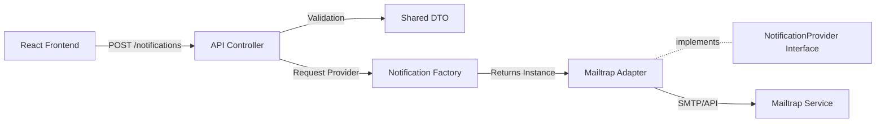

# Nexus Notification Hub


A provider-agnostic notification service built to demonstrate scalable architecture patterns within a Full-stack Monorepo.

## Architecture & Design Decisions

This project demonstrates a scalable enterprise architecture designed to decouple notification logic from external providers. The main objective is to ensure the system remains agnostic to third-party services (like Mailtrap, SendGrid, or Twilio), allowing for easy substitution without refactoring core code.

### 1. Monorepo Strategy (Nx)
Instead of managing disparate repositories, I utilized Nx to unify the Full-stack ecosystem.
- Shared Libraries: A dedicated `@nexus/shared-dtos` library acts as the single source of truth for data contracts.
- Type Safety: Changes to the DTOs immediately trigger type checks in both Frontend (React) and Backend (NestJS), preventing integration bugs at compile-time.

### 2. Design Patterns Applied
To ensure the system adheres to SOLID Principles (specifically the Open/Closed Principle), I implemented the following patterns:

* Adapter Pattern: The system communicates with a generic `NotificationProvider` interface. Specific implementations (like `MailtrapProvider`) act as adapters, translating the internal domain language to the external provider's API.
* Factory Pattern: A `NotificationFactory` encapsulates the complexity of instantiating the correct provider based on the notification type (Email, SMS, etc.), keeping the Controller clean and focused on HTTP handling.
* Strategy Pattern: The application allows runtime selection of the delivery strategy without modifying the consuming client code.

## System Overview

### Data Flow Diagram



## Demo

Video showing a test message being sent through the app and delivery confirmation in the Mailtrap dashboard:

https://github.com/user-attachments/assets/5f9febbf-4db6-492e-aa2b-e81e4434f095

### Extensibility: Adding a New Channel (e.g., SMS)

Because of the decoupled architecture, adding a new channel like SMS does not require refactoring existing logic. It is a strictly additive process:

1. Create Adapter: Implement `SmsProvider` implementing `NotificationProvider`.
2. Update Factory: Add the new case to the `NotificationFactory`.
3. Done: The rest of the application (Controllers, Services, Frontend) automatically supports the new capability via the interface.

## Tech Stack

* Monorepo Tooling: Nx 18
* Backend: NestJS, Class-Validator, Nodemailer
* Frontend: React, Vite, Tailwind CSS, Axios
* Language: TypeScript Strict Mode
* Containerization: Docker & Docker Compose (Ready)

## Getting Started

### Prerequisites

* Node.js (v18+)
* NPM or Yarn

### 1. Installation

Clone the repository and install dependencies:

```bash
git clone git@github.com:carol8fml/nexus-notification-hub.git
cd nexus-notification-hub
npm install

```

### 2. Environment Configuration

Create a `.env` file in the root directory based on `.env.example`:

```bash
cp .env.example .env

```

*Fill in your Mailtrap credentials in the generated file.*

### 3. Running the Application

Terminal 1 (Backend):

```bash
npx nx serve api

```

Terminal 2 (Frontend):

```bash
npx nx serve web

```

* API: http://localhost:3000/api
* Frontend: http://localhost:4200

## Testing

To ensure reliability and prevent regressions, the project maintains a comprehensive suite of unit tests covering the Backend (Jest), Frontend (Vitest), and Shared Contracts.

You can run all tests at once or target specific layers:

```bash
# Run all tests
npm run test

# Run specific layers
npx nx test api          # Backend (Providers & Factories)
npx nx test web          # Frontend (Components & State)
npx nx test shared-dtos  # Contract Validation

```

## Author

Carolina Gonçalves

* Role: Full-stack Developer
* Focus: Scalable Systems, Clean Code, and React/Node.js Ecosystems.

<a href="https://www.linkedin.com/in/carolina-gon%C3%A7alves-a23689198"></a>
<a href="https://mail.google.com/mail/?view=cm&fs=1&to=contato.devcarolina@gmail.com"></a>
